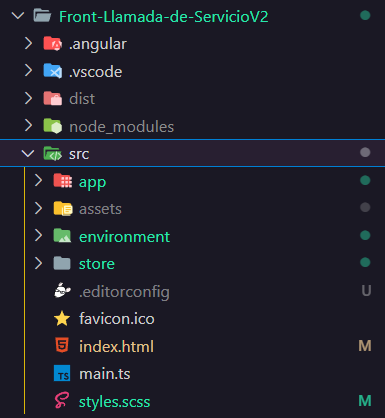
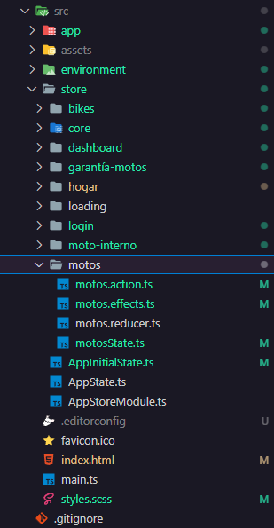
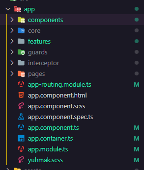
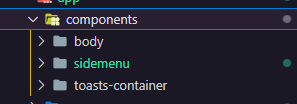
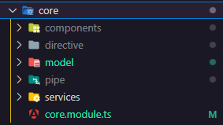
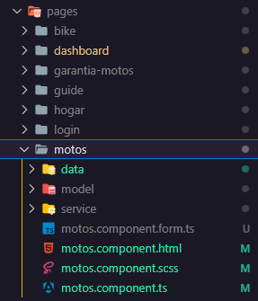

## 🚀 Estructura del Frontend:


>Estructura de la carpeta padre(src)

```
✅ app: Es la carpeta que guarda todo lo que contiene la página. Desde las vistas, hasta los servicios y lo reutilizable.
✅ assets: Se guarda las imagenes y los estilos reutilizables.
✅ environment: En esta carpeta se guarda el archivo con las variables de entorno. Estas usualmente son llamadas en los servicios para pegarle a las vistas armadas en el backend.
✅ store: La store guarda todo lo relacionado a lo que ocurre en nuestro contexto global. Esto va a estar explicado de una manera más extensa un poco más abajo.
```

<div style="height:50px"></div>



> Store (Hijo de src)
```
✅ Store posee subcarpetas, y estas subcarpetas hacen referencia a las vistas que poseen las rutas (Ejemplo: "/motos") y estas poseen de hijos los archivos que permiten que se guarden los datos dentro de la store:
- motos.action.ts: Aqui se guardan las acciones que se ejecutaran sobre mi estado global cuando se los detalle en mi reducer.
- motos.effects.ts: En los effects se procesan las solicitudes http realizadas por nuestros servicios al llamar a alguna de nuestras acciones.
-motos.reducer.ts: Aquí detallo lo que va a pasar sobre mi estado global cuando se ejecuta la acción llamada.
-motosState.ts: Dentro de este archivo se va a encontrar el tipado correspondiente al estado global.
```

<div style="height:50px"></div>



> App (Hijo de src)
```
✅ components: Carpeta en la que guardo los componentes que estan siempre a la vista del usuario.
✅ core: Dónde se guarda absolutamente todo lo reutilizable.
✅ features: Donde se guardan subvistas de una página. Por ejemplo: Si el padre es /motos y existe un /motos/id, ese id representaría a una subvista de una vista padre.
✅ guards: Lo que me permite que mis rutas cumplan con ciertos motivos por los cuales decidir si el usuario puede tener ingreso o no en base a sus permisos.
✅ interceptor: Lo que me permite mandar un header cómo puede ser una cookie o un token para que se realice una solicitud http.
✅ pages: Donde se guardan las vistas padres que se encuentran dentro de la página. Como puede ser el /login, o el /motos. 
```

<div style="height:50px"></div>



> Component (subhijo de src e hijo de app)
```
✅ Dentro de component podremos observar al body del dashboard, la barra lateral y los toast en los que puedo mostrar un mensaje al usuario.
```

<div style="height:50px"></div>



> Core (subhijo de src e hizo de app)
```
✅ Components: En esta carpeta se utilizan los componentes reutilizables.
✅ Directive: Se guardan las directivas reutilizables.
✅ Model: Se guardan los tipados correspondiente a todo lo reutilizable.
✅ Pipe: Se guardan las pipes reutilizables.
✅ Services: Se guardan los servicios correspondiente a todo lo reutilizable.
✅ core.module.ts: Es el modulo que se importa tanto los componentes, como las pipes y las directivas que reutilizo en la aplicación. Utilizar este modulo me permite reducir las importaciones dentro de los módulos principales.
```

<div style="height:50px"></div>



> Pages (subhijo de src e hizo de app)
```
Esta contiene las vistas padres. A continuación se detalla la de motos que es la que actualmente contiene los materiales que principalmente se utiliza.
✅ data: Constantes/variables usadas dentro de la vista.
✅ model: Tipado correspondiente a la vista.
✅ service: Servicios correspondiente a la utilización dentro de la vista.
✅ .form.ts: Donde guardo los formularios que utilizo dentro de la vista. Este me permite no cargar el componente typescript principal con los formularios que se cargan en esta parte.
✅ .html: HTML asociado a la vista.
✅ .scss: Scss asociado a la vista.
✅ component.ts: Typescript asociado a la vista
```